# Orulabs Cafe POS

Aplikasi POS untuk kafe/warkop hybrid (order via QR code di meja +
input manual oleh pelayan/kasir + integrasi platform delivery),
dibuat dengan Flask + SQLite. Sudah dipakai berjalan nyata di caf&eacute;
(bukan sekadar prototipe) — lengkap dengan Mode Demo untuk latihan staf
tanpa mengotori data asli, proteksi CSRF & rate limiting, dan panel
kontrol deploy jarak jauh (`ops/`, lihat bagian paling bawah).

## Screenshot

Semua screenshot di bawah diambil dari data Mode Demo (bukan data toko
sungguhan) — tema gelap untuk sisi staf (Owner/Kasir/Dapur/dst), dan
**dua tema** (terang & gelap) untuk halaman menu tamu, karena itu yang
paling sering dibuka dari HP pribadi tamu.

| | |
|---|---|
| 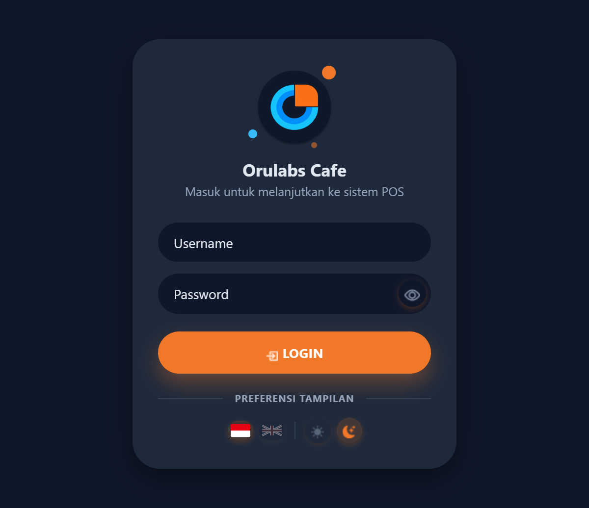 | 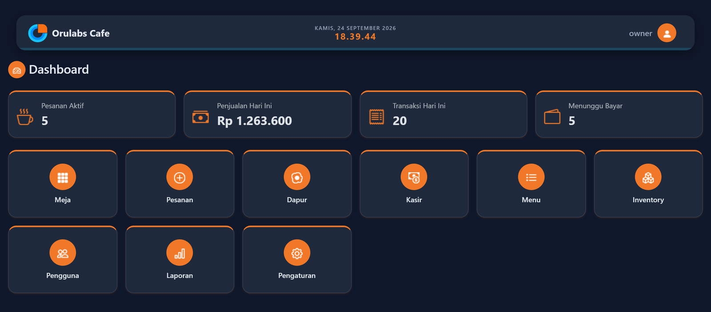 |
| Login | Dashboard — ringkasan hari ini + kartu menu ke semua fitur |
| 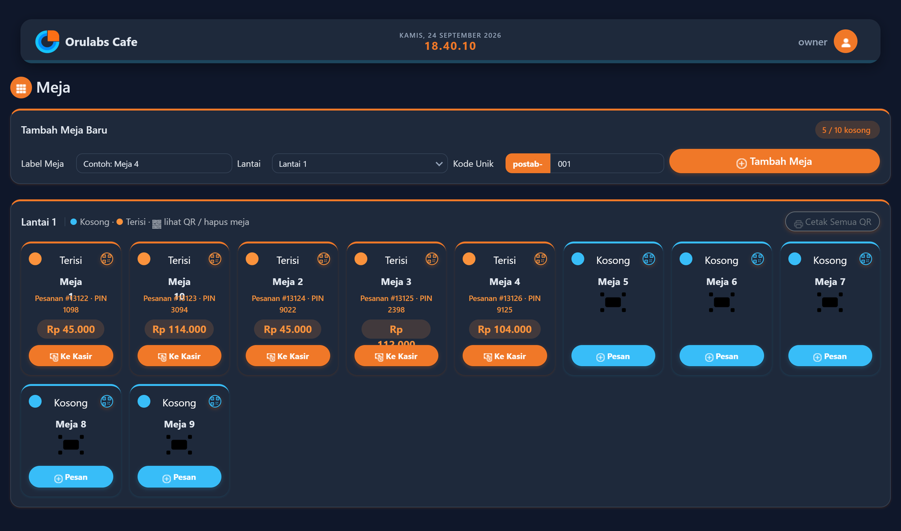 | 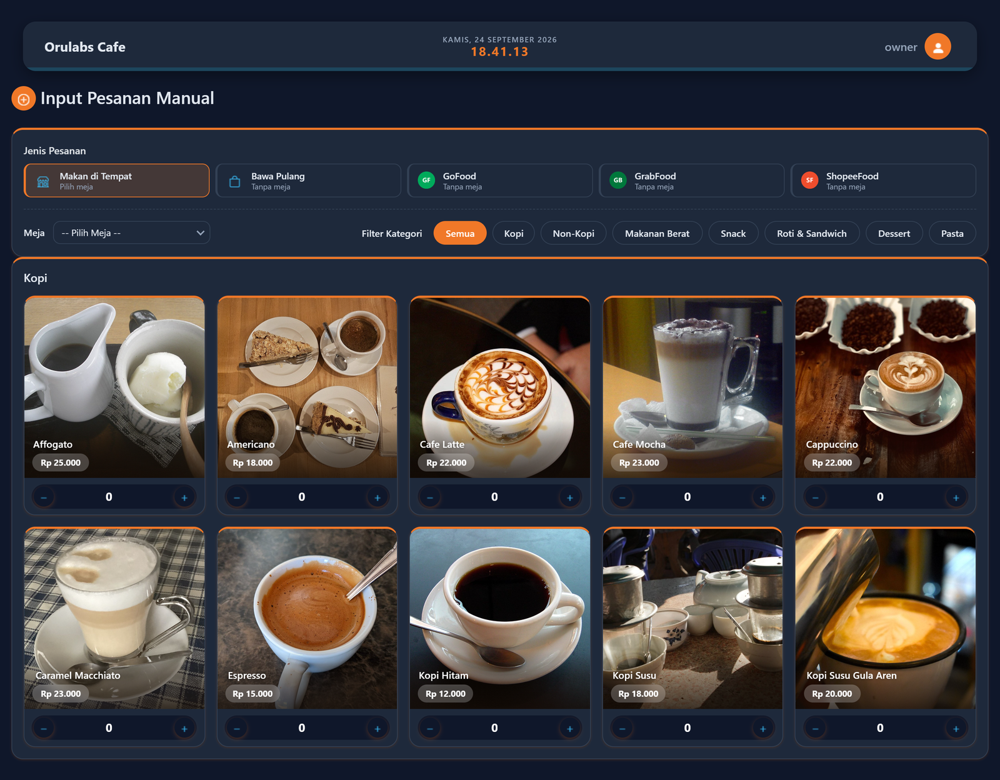 |
| Denah Meja — hijau kosong, oranye terisi | Input Pesanan Manual — Dine in / Bawa Pulang / platform delivery |
| 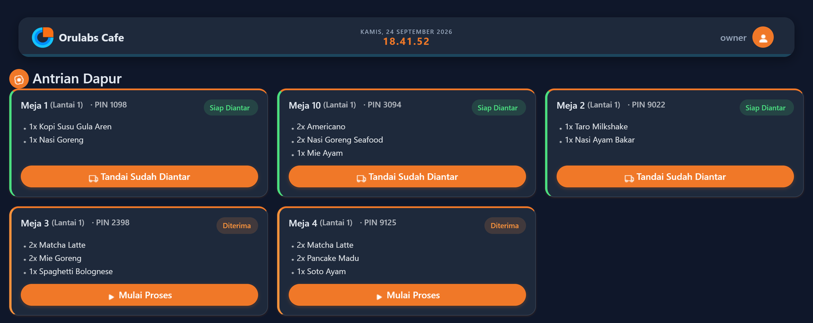 | 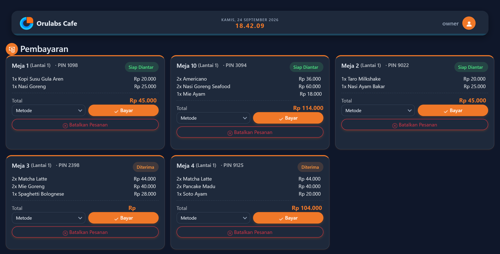 |
| Dapur — antrian & status pesanan | Kasir — antrian bayar |
| 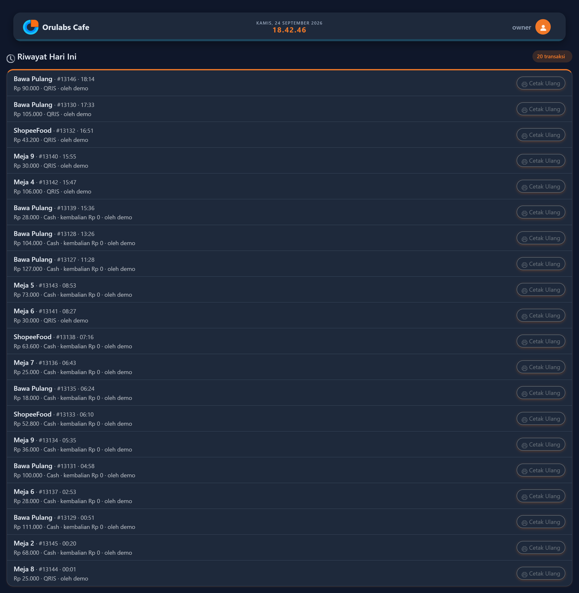 | 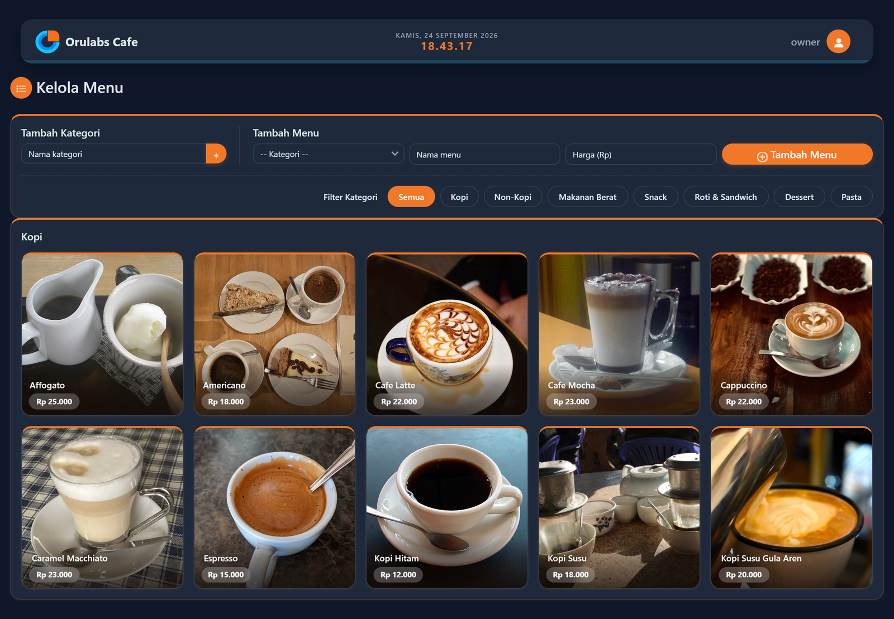 |
| Riwayat Hari Ini — cari & cetak ulang struk | Kelola Menu — kategori & item |
| 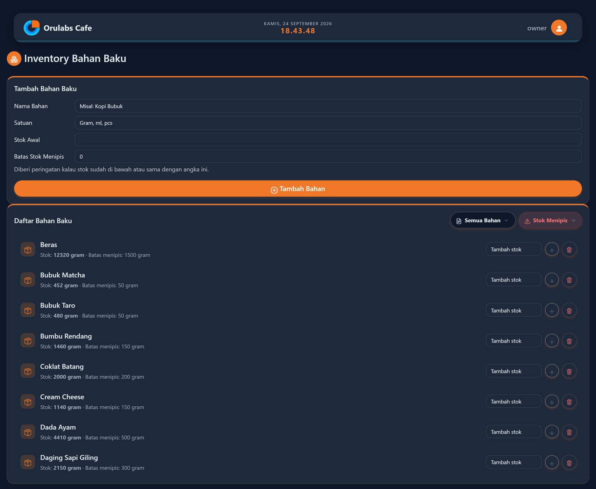 | 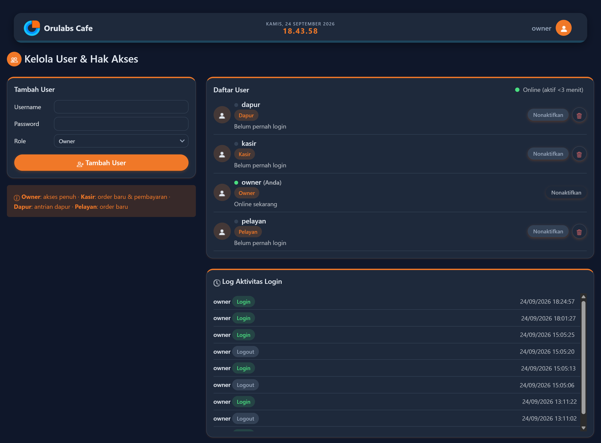 |
| Inventory Bahan Baku | Kelola User & Hak Akses |
| 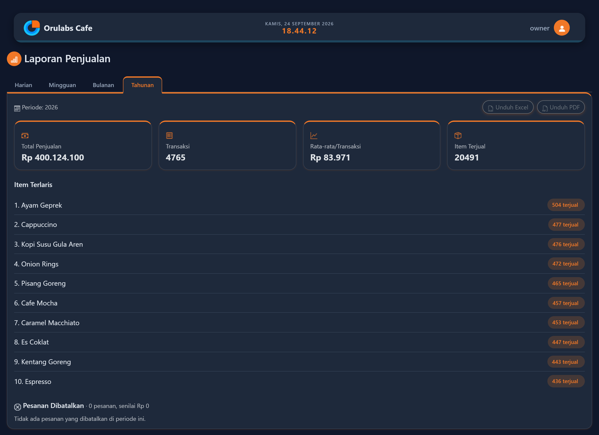 |  |
| Laporan Penjualan | Struk pembayaran siap cetak |
| 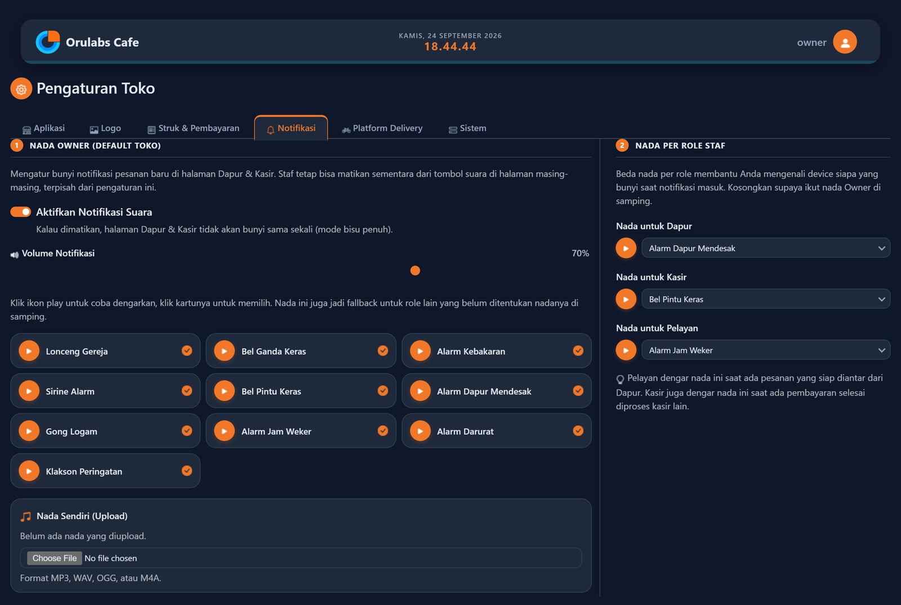 | 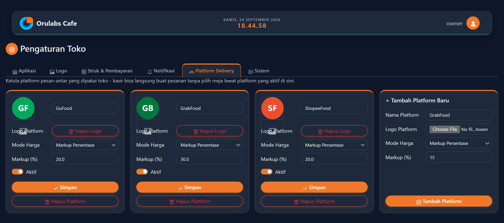 |
| Pengaturan &rarr; Notifikasi (nada beda per role staf) | Pengaturan &rarr; Platform Delivery |
| 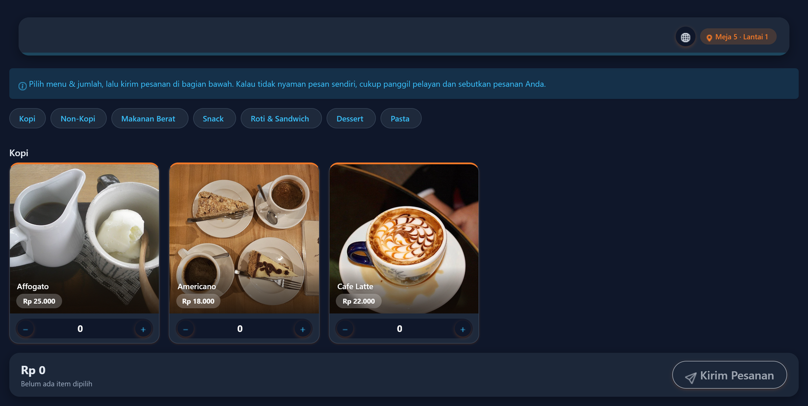 | 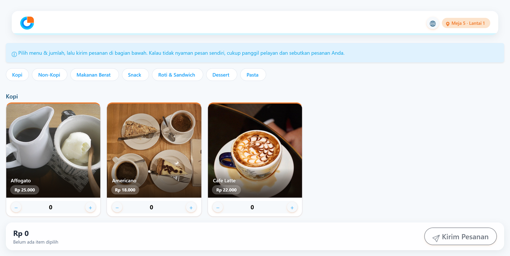 |
| Menu tamu (scan QR) — mode gelap | Menu tamu — mode terang |

## Menjalankan (development)

```bash
python -m venv venv
venv\Scripts\activate
pip install -r requirements.txt
copy .env.example .env
```

Buat tabel database:

```bash
python -c "from app import create_app, db; app = create_app(); app.app_context().push(); db.create_all()"
python seed_data.py    # opsional, isi contoh menu & meja
python seed_users.py   # wajib pertama kali, buat akun login tiap role
python run.py
```

Buka `http://127.0.0.1:5000` — akan diarahkan ke halaman login.

**Akun awal** (dari `seed_users.py`, segera ganti passwordnya lewat menu
"Kelola User" setelah login sebagai owner):

| Username  | Password    | Role    |
|-----------|-------------|---------|
| owner     | owner123    | Owner   |
| kasir     | kasir123    | Kasir   |
| dapur     | dapur123    | Dapur   |
| pelayan   | pelayan123  | Pelayan |

> Catatan: kalau port 5000 sudah dipakai aplikasi lain di komputer ini,
> set port lain lewat variabel `PORT`, misalnya `set PORT=5051 && python run.py`.

## Alur singkat

- `/t/<kode-meja>` — halaman menu untuk tamu (dibuka lewat scan QR di
  meja). Kalau meja itu masih ada pesanan berjalan punya orang lain,
  tamu diarahkan ke halaman "Meja Sedang Terisi" dengan link **Lihat
  Status Pesanan** (timeline Diterima &rarr; Diproses &rarr; Siap &rarr;
  Diantar, auto-refresh) — tanpa perlu login, tapi tetap dikunci PIN
  4 digit per pesanan supaya orang lain tidak bisa iseng
  menambah/menghapus pesanan meja itu.
- `/` — **Dashboard**, halaman utama setelah login: ringkasan statistik
  hari ini, daftar pesanan aktif, dan kartu menu ke semua fitur. Kartu
  menu punya bubble notifikasi mengikuti alur transaksi (jumlah meja
  terisi, pesanan perlu diproses dapur, menunggu bayar).
- `/tables/map` — **Denah Meja**, ala pemilihan kursi bioskop: biru =
  kosong (klik "Pesan" untuk langsung buat order di meja itu), oranye =
  terisi (info pesanan + link ke Kasir). Meja otomatis kembali kosong
  begitu dibayar lunas. Khusus Owner, halaman ini juga jadi tempat
  kelola meja & lantai: tombol "Tambah Meja"/"Tambah Lantai", ikon QR
  di tiap kartu untuk lihat/cetak QR code satuan, dan tombol **"Cetak
  Semua QR"** per lantai (PDF berisi kartu QR semua meja di lantai itu
  sekaligus, termasuk info WiFi toko kalau diisi di Pengaturan).
- `/orders/new` — input pesanan manual oleh pelayan/kasir/owner. Diawali
  pilih **Jenis Pesanan**: Makan di Tempat (lanjut pilih meja), Bawa
  Pulang, atau salah satu **platform delivery** yang aktif (GoFood/
  GrabFood/ShopeeFood/dll) — untuk jenis selain Makan di Tempat, tidak
  perlu pilih meja sama sekali, harga menu otomatis menyesuaikan markup
  platform tersebut.
- `/kitchen` — antrian dapur, update status pesanan (Diterima &rarr;
  Diproses &rarr; Siap Diantar). Ada **notifikasi suara otomatis** tiap
  ada pesanan baru masuk, plus tombol mute/unmute (preferensi tersimpan
  per-device). Pesanan dari platform delivery ditandai lencana kecil
  logo platform di kartunya, begitu juga di Kasir.
- `/pelayan` — **Siap Diantar**: daftar pesanan yang sudah selesai
  dimasak dan menunggu diantar ke meja, khusus role Pelayan/Owner. Ada
  notifikasi suara sendiri juga tiap ada pesanan baru masuk status
  "Siap" dari Dapur.
- `/cashier` — tandai pesanan sudah dibayar (Cash/QRIS, kembalian
  otomatis dihitung untuk Cash) lalu lanjut otomatis ke struk. Ada
  **notifikasi suara** tiap pesanan baru menunggu pembayaran, tombol
  **"Batalkan Pesanan"** (tercatat siapa & kapan di log, buat pesanan
  salah input), dan bagian **"Riwayat Hari Ini"** buat cari transaksi
  yang sudah lunas dan **cetak ulang struknya** — solusi kalau kertas
  printer habis di tengah jalan atau ada yang minta struk lagi.
- `/orders/<id>/receipt` — struk siap cetak (logo, alamat, kontak,
  sosial media, nama kasir yang melayani, rincian item, PPN kalau
  aktif) — ada tombol cetak langsung & unduh PDF. Untuk pesanan dari
  platform delivery, struk memakai **logo platform** itu sendiri,
  bukan logo toko.
- `/admin/menu` — kelola menu (khusus Owner). Tiap item menu bisa
  diatur **resep bahan baku**-nya lewat modal foto (klik gambar
  menu &rarr; bagian "Resep Bahan Baku") — pilih bahan & jumlah pemakaian
  per porsi.
- `/admin/inventory` — **Inventory Bahan Baku** (khusus Owner): catat
  stok bahan (kopi, susu, gula, kemasan, dll) beserta satuan & batas
  stok menipis, plus tombol ekspor Excel/PDF. Begitu ada resep diatur
  di suatu menu, stok bahan otomatis **berkurang tiap ada pesanan
  masuk** (baik dari kasir/pelayan maupun tamu scan-QR, dijaga atomik
  supaya 2 pesanan yang masuk nyaris bersamaan tidak bisa berdua lolos
  cek stok yang sama) — dan pesanan akan **ditolak dengan pesan jelas**
  kalau stok bahannya tidak cukup. Menu yang bahannya habis otomatis
  hilang dari daftar pesan.
- `/admin/users` — kelola user & role, dengan indikator **online
  real-time** per akun, foto profil tiap user, dan **log aktivitas
  login/logout** semua akun (khusus Owner). Akun yang dinonaktifkan
  langsung kehilangan akses di request berikutnya, tidak perlu tunggu
  dia logout sendiri.
- Dropdown profil di navbar — khusus Owner, ada ringkasan **"Staf
  Online"**. Semua user juga bisa **ganti bahasa** (Indonesia/English)
  dan **mode terang/gelap** lewat bendera & ikon di dropdown yang sama —
  pilihan tersimpan per-device.
- `/admin/settings` — nama toko, logo, footer, alamat, telepon, sosial
  media, info **WiFi** (ditampilkan di kartu cetak QR meja, karena
  aplikasi ini jalan di jaringan lokal), lebar kertas printer thermal
  (58mm/80mm), PPN, gambar QRIS offline toko, tab **Notifikasi** (nada
  beda per role: Dapur/Kasir/Pelayan, aktif/nonaktifkan suara, volume),
  tab **Platform Delivery** (tambah/nonaktifkan platform, upload logo,
  markup persentase otomatis atau harga manual per item), dan tab
  **Sistem** (Bersihkan Cache, Backup Database, Mode Perbaikan, dan
  **Mode Demo** — lihat bagian tersendiri di bawah) — khusus Owner.
- `/reports` — laporan penjualan, dipisah 4 tab (Harian/Mingguan/
  Bulanan/Tahunan), tiap tab ada 4 card ringkasan (total penjualan,
  jumlah transaksi, rata-rata per transaksi, item terjual), daftar item
  terlaris, dan daftar pesanan dibatalkan di periode itu (khusus Owner).

## Mode Demo

Owner bisa mengisi aplikasi dengan **data contoh yang realistis** (menu
lengkap dengan foto, bahan baku & resep, 10 meja, 3 platform delivery
contoh, sampai riwayat transaksi & laporan penjualan bulanan/tahunan) —
berguna untuk latihan staf baru atau demo ke calon pelanggan, tanpa
menyentuh data asli toko sama sekali. Semua data contoh ditandai
tersendiri di database dan **dihapus bersih** (termasuk foto & file QR
di disk) begitu Mode Demo dimatikan lagi.

Diaktifkan lewat Pengaturan &rarr; Sistem, tapi **dikunci PIN developer**
terpisah dari login biasa — supaya pemilik toko (yang notabene
"Owner" di sistem role) tetap tidak bisa mengaktifkannya sendiri tanpa
sepengetahuan developer aplikasi.

## Hak akses per role

| Role    | Akses |
|---------|-------|
| Owner   | Semua halaman (menu, meja, user, laporan, pengaturan, dll) |
| Kasir   | Dashboard, Denah Meja, Order Baru, Kasir (pembayaran) |
| Dapur   | Dashboard, Denah Meja, Dapur (update status pesanan) |
| Pelayan | Dashboard, Denah Meja, Order Baru, Siap Diantar |

Semua role bisa lihat Denah Meja (untuk tahu meja mana yang kosong),
tapi cuma Owner yang bisa tambah meja/lantai/lihat QR di halaman itu.

Halaman `/t/<kode-meja>` (menu untuk tamu, lewat scan QR) tetap terbuka
tanpa login — hanya halaman staff yang butuh akun.

## Bahasa (i18n)

Aplikasi mendukung Indonesia (default) & English lewat Flask-Babel.
Teks Indonesia di kode adalah sumber asli (`msgid`), terjemahan
Inggris ada di `app/translations/en/LC_MESSAGES/messages.po`. Kalau
menambah teks baru yang perlu ikut diterjemahkan, bungkus dengan
`{{ _('...') }}` di template atau `gettext()`/`lazy_gettext()` di
Python, lalu jalankan:

```bash
pybabel extract -F babel.cfg -k _l -o app/translations/messages.pot .
pybabel update -i app/translations/messages.pot -d app/translations -l en
# isi msgstr yang masih kosong di messages.po, lalu:
pybabel compile -d app/translations
```

## Keamanan

- **Proteksi CSRF** aktif di semua form (Flask-WTF).
- **Rate limiting** di login (maks percobaan gagal per IP+username) dan
  PIN meja tamu, supaya tidak gampang ditebak paksa.
- Sesi idle otomatis logout, dan session token benar-benar dicabut di
  server saat logout (bukan cuma hapus cookie di browser).
- Password di-hash (werkzeug), tidak pernah tersimpan/tertampil polos.

## Tes otomatis

Ada test suite (`pytest`) untuk logika paling berisiko kalau sampai
salah tanpa disadari: perhitungan PPN, potong/kembalikan stok bahan
baku (termasuk simulasi race condition), pembuatan pesanan (3 jenis),
dan pembayaran (kembalian, snapshot PPN, penjaga bayar-dobel). Lihat
[`tests/README.md`](tests/README.md) untuk cara menjalankannya.

## Belum termasuk (sengaja disederhanakan dulu)

- Cetak struk pakai dialog print browser ke printer thermal yang sudah
  terinstall sebagai printer Windows biasa — bukan integrasi ESC/POS
  level rendah, tapi cukup untuk kebutuhan sekarang.
- Update status pakai auto-refresh sederhana (bukan real-time
  websocket) — cukup untuk skala 1 kafe, lebih gampang di-maintain
  sendiri.

## Deployment (production) & akses dari tablet/HP

Development server (`run.py`) cuma untuk coding di komputer sendiri.
Untuk dipakai sehari-hari (diakses tablet kasir, HP dapur, dan QR
tamu), jalankan lewat `serve_production.py` (pakai `waitress`),
default di port 8000:

```bash
python serve_production.py
```

Panduan lengkap pindah ke 1 PC/mini PC sebagai server — set IP statis,
`.env` production, setup database awal, buka firewall, jalankan
sebagai Windows Service (auto-start & auto-restart), sampai backup
otomatis — ada di **[DEPLOYMENT.md](DEPLOYMENT.md)**.

Panduan lengkap pemakaian aplikasi sehari-hari (kasir, dapur, pelayan,
owner, tamu) dalam bentuk buku manual siap cetak (21 halaman) — ada di
**[docs/BUKU_PANDUAN.pdf](docs/BUKU_PANDUAN.pdf)**. Kalau layout/tema/data
di aplikasi berubah dan screenshot perlu di-refresh, ambil ulang gambar ke
`docs/screenshots/` lalu jalankan `python docs/build_manual.py` untuk
membuat ulang PDF-nya.

## Kontrol deploy jarak jauh (`ops/`)

Folder `ops/` berisi alat bantu terpisah dari aplikasi POS-nya sendiri:
sebuah "Ops Agent" kecil yang jalan di tiap mini PC toko (lihat/pasang
lewat `ops/install_agent.ps1`), dan dashboard kontrol (`ops/dashboard.html`,
dibuka lewat `ops/dashboard_server.py` di laptop developer) yang bisa,
lewat jaringan Tailscale:

- Melihat versi kode yang sedang jalan vs commit terbaru di GitHub.
- Update satu klik (tarik kode terbaru, restart aplikasi) — dengan
  pengaman: kalau internet toko lagi putus, update dibatalkan otomatis
  dan aplikasi **tidak** ikut dimatikan sia-sia.
- Rollback ke commit sebelumnya kalau update terbaru ternyata bermasalah.
- Lihat log error dari jarak jauh, dan verifikasi file backup database
  (bukan cuma "ada filenya", tapi beneran dicek bisa dipulihkan).

Dashboard-nya bind ke `0.0.0.0` (bisa dibuka dari HP lewat Tailscale, lihat
"Aplikasi Android" di bawah), jadi **wajib** diisi `DASHBOARD_PASSWORD` di
`ops/.env` sebelum dijalankan — tanpa itu `dashboard_server.py` langsung
berhenti saat start. Daftar mini PC yang terdaftar (nama/IP/token) disimpan
di `ops/dashboard_agents.json` (server-side, sengaja tidak masuk git),
bukan localStorage browser, supaya selalu konsisten mau dibuka dari
browser/device apa pun.

Dipakai developer untuk memelihara instalasi di lokasi lain tanpa perlu
remote desktop. Lihat komentar di `ops/agent.py` untuk detail arsitekturnya.

## Aplikasi Android (opsional)

Folder `android-app/` berisi wrapper WebView sederhana supaya staf bisa
buka aplikasi ini lewat ikon di home screen HP/tablet seperti aplikasi
Android biasa (tidak hilang seperti shortcut PWA kalau kena hapus tidak
sengaja). Ini **template** - sebelum build APK untuk toko tertentu, wajib
edit dulu:

- `android-app/app/src/main/res/values/strings.xml` - `server_url`, isi
  alamat IP server toko yang sebenarnya (samakan dengan `BASE_URL` di
  `.env`).
- `android-app/app/src/main/res/xml/network_security_config.xml` - IP di
  situ juga harus sama persis dengan `server_url` di atas.
- (Opsional) ganti ikon di `android-app/app/src/main/res/mipmap-*/` dan
  `drawable/ic_launcher_foreground.png` dengan logo toko yang bersangkutan.

Build APK debug (butuh JDK 17 + Android SDK terpasang):

```bash
cd android-app
.\gradlew.bat assembleDebug
```

Hasilnya ada di `android-app/app/build/outputs/apk/debug/app-debug.apk`.

Folder `android-ops-dashboard/` sama polanya, tapi untuk Dashboard Kontrol
Deploy (`ops/dashboard.html`) - dipakai developer/IT sendiri, bukan staf
toko, supaya bisa Update/Rollback mini PC dari HP lewat Tailscale tanpa
buka browser dan ketik alamat manual. Wajib edit dulu sebelum build:

- `android-ops-dashboard/app/src/main/res/values/strings.xml` -
  `server_url`, isi IP Tailscale laptop yang menjalankan
  `ops/dashboard_server.py` (lihat `tailscale ip -4` di laptop itu).
- `android-ops-dashboard/app/src/main/res/xml/network_security_config.xml` -
  samakan IP-nya dengan `server_url` di atas.
- Dashboard-nya sendiri wajib sudah diisi `DASHBOARD_PASSWORD` di
  `ops/.env` (lihat bagian "Kontrol deploy jarak jauh" di atas) sebelum
  di-bind ke jaringan/Tailscale.

```bash
cd android-ops-dashboard
.\gradlew.bat assembleDebug
```

## Lisensi

Proprietary — hak cipta dilindungi. Lihat [LICENSE](LICENSE).
